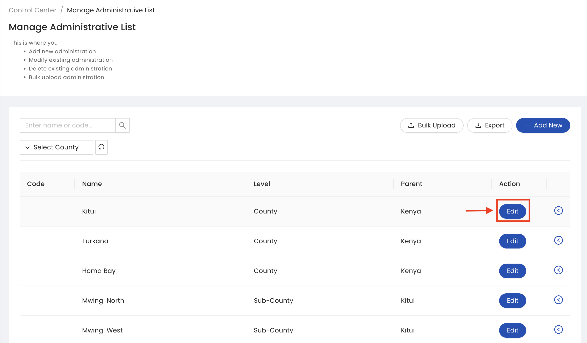
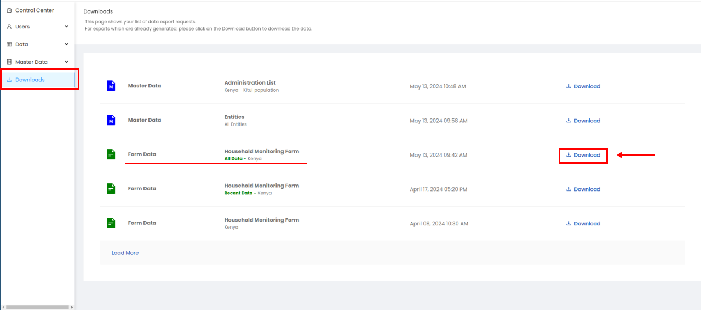

.. raw:: html

    

.. role:: heading

:heading:`Master Data Management`

.. role:: bolditalic

Administrative List
--------------------

1. From the Sidebar of the control center, click the administrative list sub menu under the Master Data menu, add or modify an existing administration or delete an existing administration.

.. image:: ../assests/image51.png
    :alt: Administrative Lis
    :width: 100%

2. To add a new administration, click the ADD NEW button. Next, select the administration level and fill all the mandatory fields. Finally, click the Save button to add the administration.

.. image:: ../assests/image53.png
    :alt: Add Administration
    :width: 100%

3. To delete or edit an existing administration, click the Edit button next to the administration, Once data is updated click on the :bolditalic:`Save` Button

4.To delete click the Delete button. Next, confirm you are deleting the administration by clicking the OK button in the pop-up window.

.. image:: ../assests/image55.png
    :alt: Deleting Administration2
    :width: 100%

Administrative Bulk Upload
----------------------------

1. Click on the :bolditalic:`Bulk Upload` Button 

.. image:: ../assests/image57.png
    :alt: Bulk Upload Image
    :width: 100%

2. Select the attribute if you want to inlude or click on the :bolditalic:`Download` Button. Click the Prefilled administrative list for downloading the template with already updated data.

.. image:: ../assests/image58.png
    :alt: Bulk Upload image1
    :width: 100%

3. To see the pre-filled administrative data export requests. Click the :bolditalic:`Download` Button to download the data.

.. image:: ../assests/image59.png
    :alt: Bulk Upload image1
    :width: 100%

Administrative Download
-----------------------------

**Sampling**
The sources of data for the RTMIS are both primary and secondary. The data will be collected from all the 47 counties in Kenya. The basic unit for the sanitation and hygiene primary data shall be the households in both Rural and urban setups. Sanitation and hygiene primary data shall also be collected from Schools and health care facilities nationwide.   Secondary data will be collected at the county level to report on financing. At the sub-county level, urban sanitation data will be enriched with data/information from the WARIS system. During phase 1 of RUSH RTMIS implementation, data collection shall proceed as follows:

* Data shall be collected from every village/community in the 47 counties of kenya
* In each village/community, 20 HHs shall be picked randomly. This sampling method will apply for both rural and urban villages/communities
* All schools  from all the 47 counties shall be surveyed
* All levels of health care facilities from all the 47 counties shall be surveyed

During phase 2 of RUSH RTMIS implementation, data collection will be done at every household. Therefore there shall be no sampling of households moving forward.

**HH coding**
* To ensure ease of reference during repeat data collection (particularly during phase 2 of RUSH RTMIS implementation), all households will be coded with a unique code
* This unique code will apply when the RUSH protocol is fully implemented 
* The Unique Code shall be composed as follows:  Village name+SN + HH Head's Surname

Manage Attributes
--------------

1. From the Data menu of the sidebar, click on the :bolditalic:`Manage Data` submenu.

.. image:: ../assests/image51.png
    :alt: Deleting Data
    :width: 100%

2. Expand the toggle button next to a data point to delete it.

.. image:: ../assests/image43.png
    :alt: Deleting Data
    :width: 100%

Manage Entities
-----------------
1. Select the questionnaire and click on :bolditalic:`Download Data` button

.. image:: ../assests/image11.png
    :alt: Downloading Data
    :width: 100%

Manage Organizations
---------------------

1. Manage organisation asmvasd asjvdamsd asmdvs masvdms