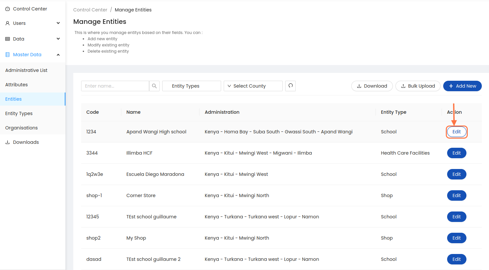
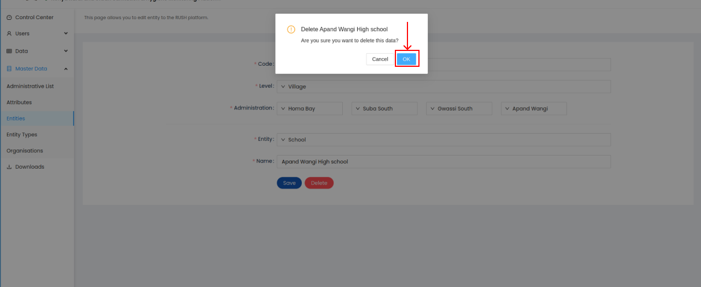

.. raw:: html

    

.. role:: heading

:heading:`Master Data Management`

.. role:: bolditalic

Administrative List
--------------------

1. From the Sidebar of the control center, click the administrative list sub menu under the Master Data menu, add or modify an existing administration or delete an existing administration.

2. To add a new administration, click the ADD NEW button. Next, select the administration level and fill all the mandatory fields. Finally, click the Save button to add the administration.

3. To delete or edit an existing administration, click the Edit button next to the administration, Once data is updated click on the :bolditalic:`Save` Button

.. image:: ../assests/image54.png
    :alt: Deleting Administration1
    :width: 100%

4.To delete click the Delete button. Next, confirm you are deleting the administration by clicking the OK button in the pop-up window.

.. image:: ../assests/image56.png
    :alt: Deleting Administration3
    :width: 100%        

Administrative Bulk Upload
----------------------------

1. Click on the :bolditalic:`Bulk Upload` Button 

2. Select the attribute if you want to inlude or click on the :bolditalic:`Download` Button. Click the Prefilled administrative list for downloading the template with already updated data.

3. To see the pre-filled administrative data export requests. Click the :bolditalic:`Download` Button to download the spredsheet data.

Manage Attributes
-------------------

1. From the Sidebar of the control center, click the attribute sub menu under the Master Data menu, add or modify an existing attribute or delete an existing attribute.

2. To add a new attributes, click the ADD NEW button. Next, select the attribute type and fill attribute name. Finally, click the Save button to add the attribute.    

3. To delete or edit an existing attribute, click the Edit button next to the attribute, Once data is updated click on the :bolditalic:`Save` Button, For deleting the attribute Click :bolditalic:`Delete` Button. Next, click on the confirmation popup window for deleting attribute.

Manage Entities
-----------------

1. From the Sidebar of the control center, click the Entities sub menu under the Master Data menu, add or modify an existing entity based on their fields or delete an existing entity.

2. To add a new entity, click the ADD NEW button. Next, fill all mandatory fileds. Finally, click the Save button to add the entity.

3. To delete or edit an existing entity, click the Edit button next to the entity, Once data is updated click on the :bolditalic:`Save` Button, For deleting the entity Click :bolditalic:`Delete` Button. Next, click on the confirmation popup window for deleting entity.

.. image:: ../assests/image68.png
    :alt: Deleting Administration1
    :width: 100%    

Manage Organizations
-----------------------
1. Select the questionnaire and click on :bolditalic:`Download Data` button

.. image:: ../assests/image11.png
    :alt: Downloading Data
    :width: 100%

.. image:: ../assests/image44.png
    :alt: Downloading Data
    :width: 100%
