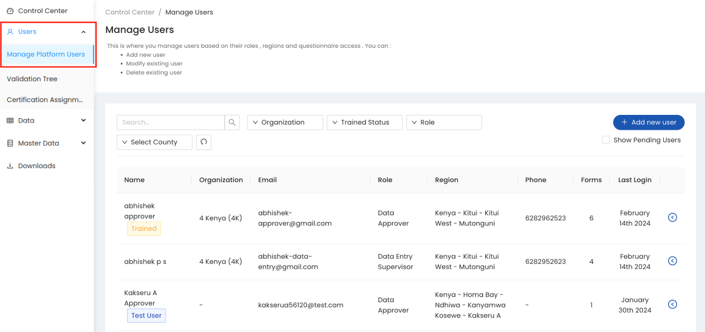
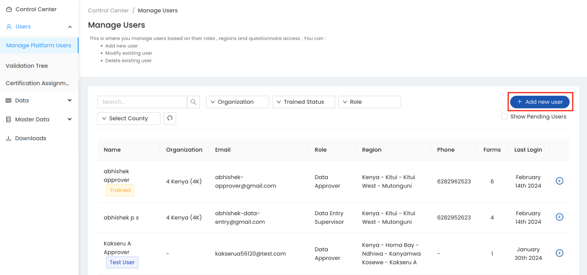
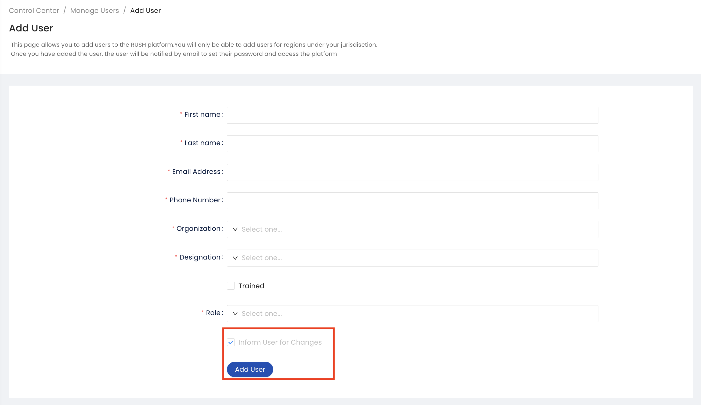
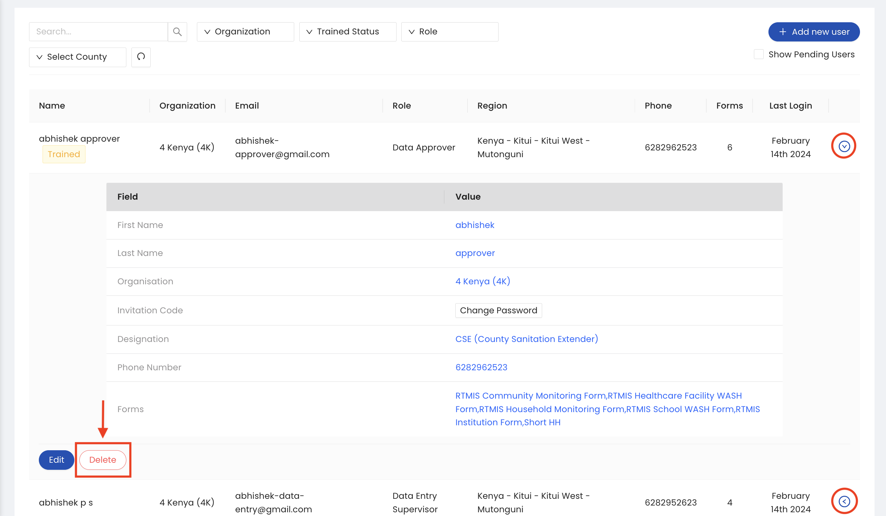
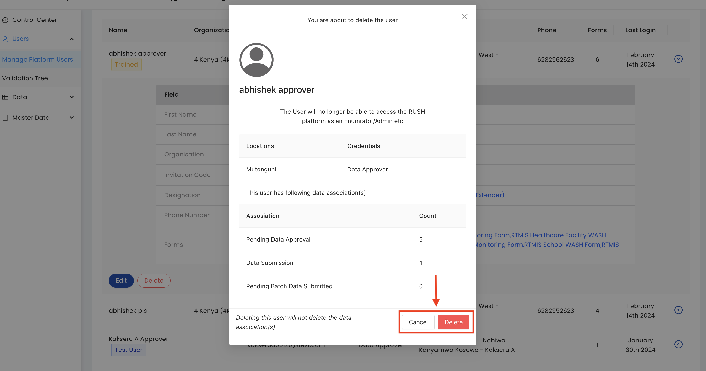
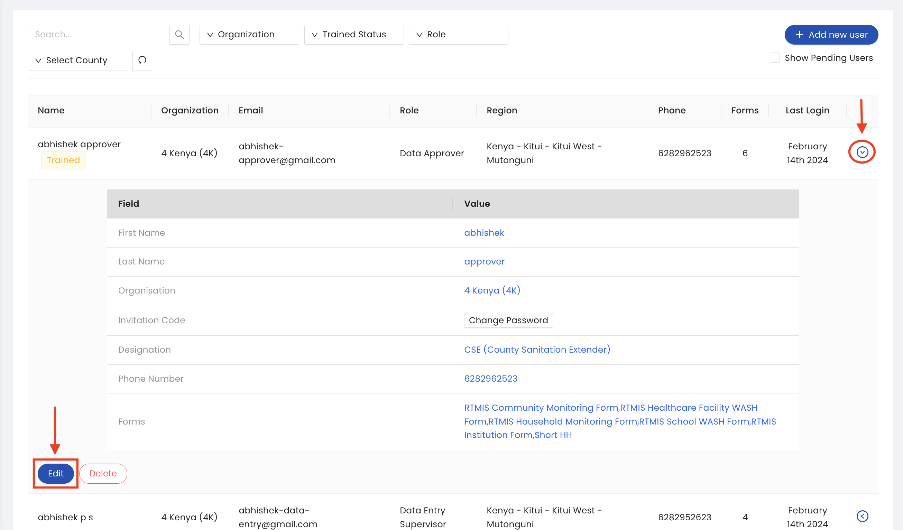
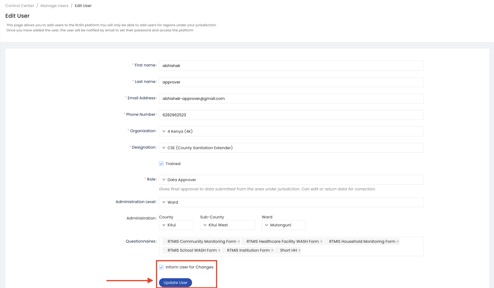
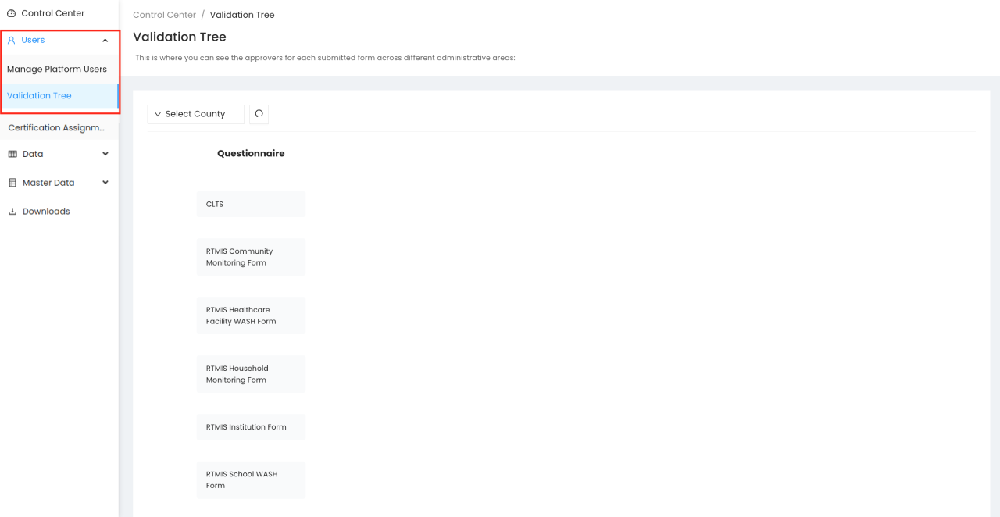
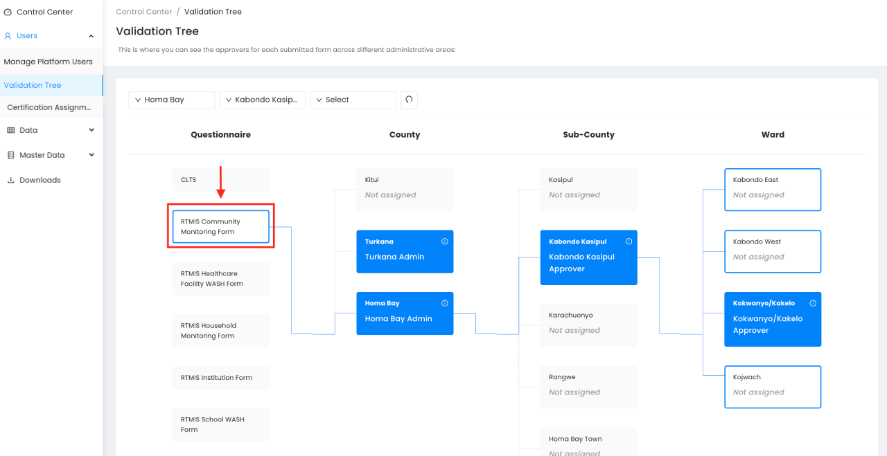

.. raw:: html

    

.. role:: bolditalic
.. role:: heading

:heading:`Administration`

Manage Users (Add, Delete and Modify Users)
--------------------------------------------

1. From the Sidebar of the control center, click the :bolditalic:`Users` menu to add a new user, modify an existing user or delete an existing user.

2. To add a new user, click the :bolditalic:`ADD NEW USER` button. Next, on the new page fill all the mandatory fields and assign the user an organisation, designation, role, administrative region and questionnaires. Finally, click the Add User button to notify your new user.

3. To delete an existing user, expand the toggle button next to the user and click the delete the :bolditalic:`DELETE` button. Next, confirm you are deleting the user by clicking the DELETE button in the pop-up window.

4. To modify an existing user, expand the toggle button next to the user and click the :bolditalic:`EDIT` button. Edit the user details in the new page and then click the :bolditalic:`UPDATE USER` button.

Validation Tree`
------------------------------

1. Select the :bolditalic:`Validation Tree` sub menu from the users menu section of the sidebar to see the approvers for each submitted form across different administrative areas.

2. Click on the questionnaire blocks and administrative blocks to see the approvers for each submitted form across different administrative areas

