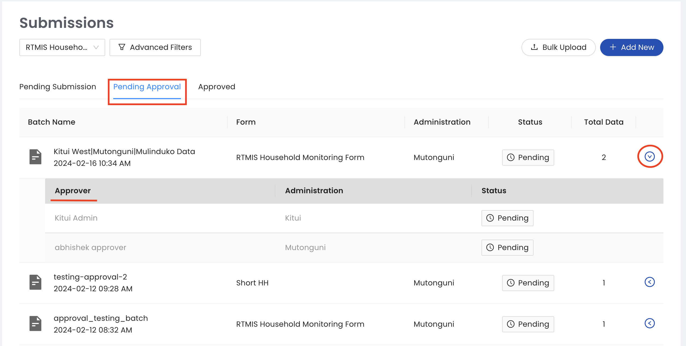
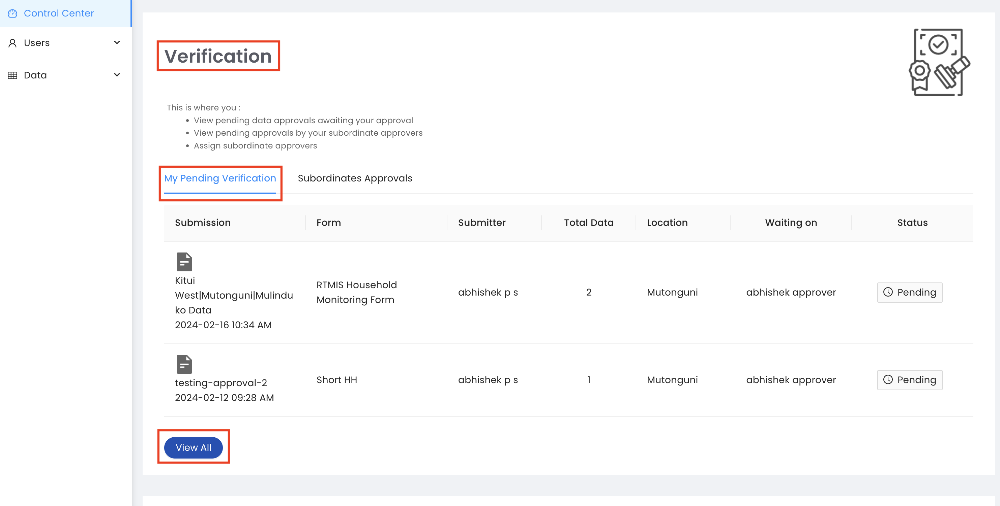
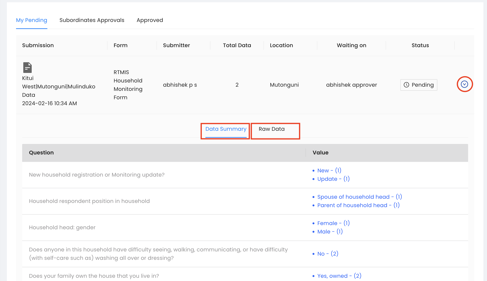
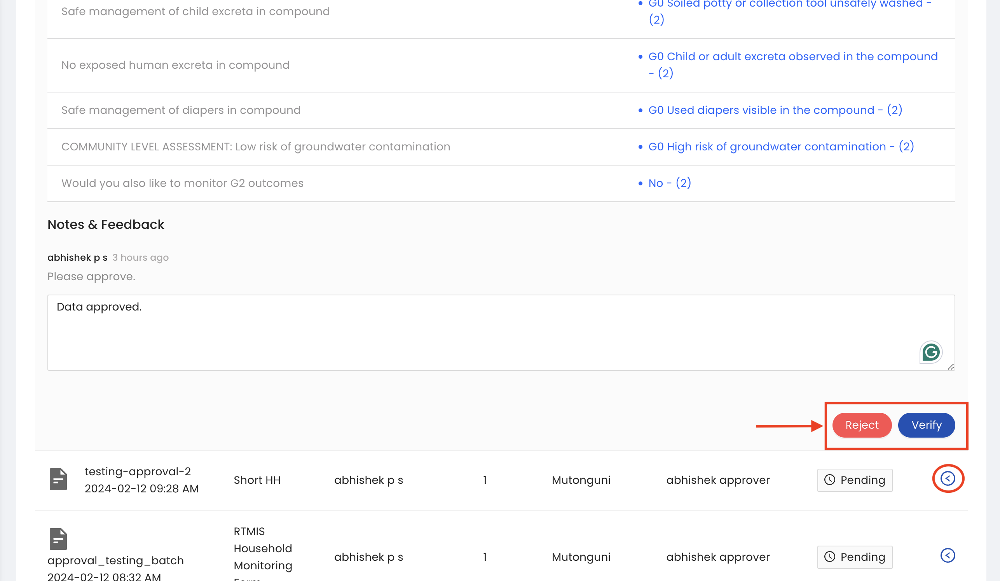
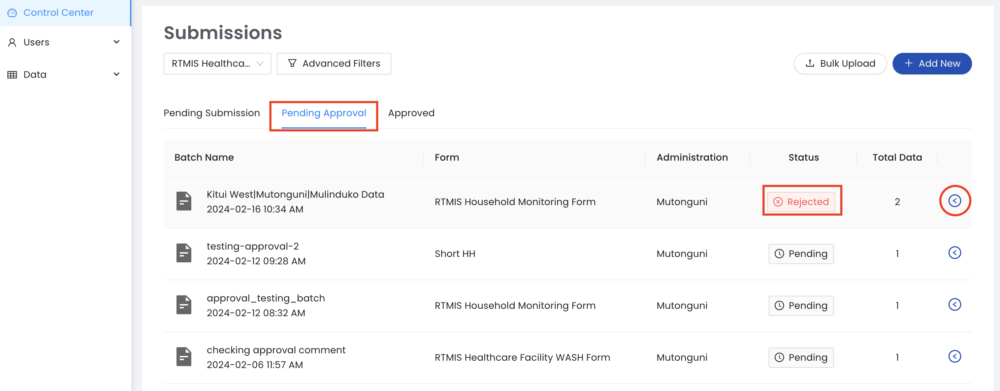
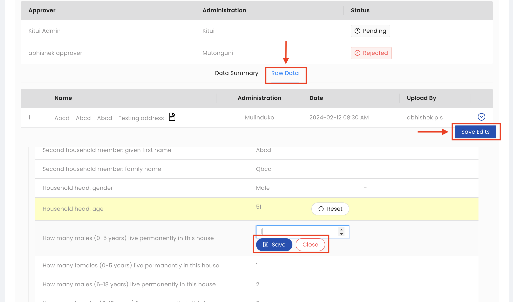

.. raw:: html

    

.. role:: bolditalic
.. role:: heading

:heading:`Approval workflow`

.. role:: bolditalic

Submitting Data for Approval
-----------------------------

.. note::
  Please note, the approval workflow does not apply to the submission of :ref:`verification<verification_data>` and :ref:`certification<certification_data>` data.
  This is because both types of submissions do not require revalidation at each administrative level and will be directly saved as data points.

1. All data that is pending submission for approval will appear on the pending submission tab. Note that you will need to select different questionnaires to see :bolditalic:`pending submissions` for each questionnaire. This is to avoid batching data from different questionnaires in one batch for approval which is not valid.

  .. image:: ../assests/image37.png
     :alt: Data validation
     :width: 100%

2. Next, select all the datasets you are submitting for approval by ticking the checkbox next to each data set then click the :bolditalic:`BATCH SELECTED DATASETS` button.

  .. image:: ../assests/image45.png
     :alt: Data validation
     :width: 100%

3. In the pop-up window, label your batch with a relevant name and add any comment for your approver. Next, click the :bolditalic:`CREATE A NEW BATCH` button.

.. image:: ../assests/image14.png
    :alt: Data validation
    :width: 100%

4. Your dataset is now submitted for approval and will appear in the :bolditalic:`pending approval` tab. You can expand each data set to see your approver who will receive an email notification to approve your data.Notifications/Alerts

Approving Data
---------------

1. Data Approvers will receive an E-mail notification every time there is data that needs their approval within their assigned administrative region. Log in to approve the data.

.. image:: ../assests/image32.png
   :alt: Approving
   :width: 100%

2. All datasets that are pending approval will appear in the :bolditalic:`Verification` section of the Control center. Click the :bolditalic:`View All` button to begin the approval process.

3. To approve or decline a dataset, expand the toggle button next to each data set. Here we have two tabs:
**Data Summary**: A quick snapshot of the data you are approving.
**Raw Data**: From this tab, you can access the raw data, make edits and save edits.
You can add notes and feedback and the data submitter will receive an email notification once the dataset is approved or declined.

4. Once the data is is approved it will move to the approved tab.  

1. Note: Rejected datasets will appear in the :bolditalic:`My Pending Approvals` tab with the status :bolditalic:`Rejected:bolditalic:`. The status will change to :bolditalic:`Pending` when the data submitter updates the rejected dataset as per the Approver’s instructions.

Handling Rejected Data
-----------------------

1. Rejected datasets will appear in the :bolditalic:`Pending Approval` tab with the status :bolditalic:`Rejected:bolditalic:`. Enumerators will receive an email notification when their data is rejected with an explanation from the approver why the data was rejected. Next, expand the toggle button next to the rejected dataset to make edits and resubmit your dataset.

2. From the :bolditalic:`Raw Data` tab, make any edits as per your Approver’s instructions. You can reset to default values in case you make an error while editing. Finally, when you are done with all edits click the :bolditalic:`SAVE EDITS` button. Your dataset will now appear under :bolditalic:`Pending Approval` with the status :bolditalic:`Pending` and your Approver will be able to review and approve again.

