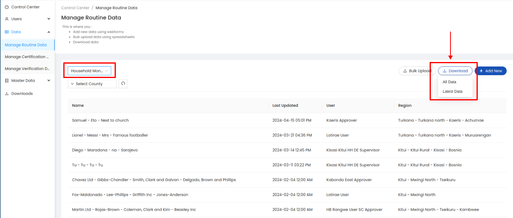

.. raw:: html

    

.. role:: heading

:heading:`Data Management`

.. role:: bolditalic

Data Protection Act
--------------------

* The data protection act seeks to give effect to Article 31(c) and (d) of the Constitution that contain the right to privacy, regulate the processing of personal data, provide for the rights of data ‘subjects’; and defines the obligations of data ‘controllers’ (person who determines the purpose and means of processing of personal data) and ‘processors’ (person who processes personal data on behalf of the data controller).

* Every data controller or data processor is required to ensure the storage, on a server or data centre located in Kenya, of at least one serving copy of personal data to which the Act applies. Cross-border processing of sensitive personal data is prohibited and only allowed when certain conditions are met or under certain circumstances specified in the Act.

Collecting Data in the Field
-----------------------------

**Sampling**
The sources of data for the RTMIS are both primary and secondary. The data will be collected from all the 47 counties in Kenya. The basic unit for the sanitation and hygiene primary data shall be the households in both Rural and urban setups. Sanitation and hygiene primary data shall also be collected from Schools and health care facilities nationwide.   Secondary data will be collected at the county level to report on financing. At the sub-county level, urban sanitation data will be enriched with data/information from the WARIS system. During phase 1 of RUSH RTMIS implementation, data collection shall proceed as follows:

* Data shall be collected from every village/community in the 47 counties of kenya
* In each village/community, 20 HHs shall be picked randomly. This sampling method will apply for both rural and urban villages/communities
* All schools  from all the 47 counties shall be surveyed
* All levels of health care facilities from all the 47 counties shall be surveyed

During phase 2 of RUSH RTMIS implementation, data collection will be done at every household. Therefore there shall be no sampling of households moving forward.

**HH coding**
* To ensure ease of reference during repeat data collection (particularly during phase 2 of RUSH RTMIS implementation), all households will be coded with a unique code
* This unique code will apply when the RUSH protocol is fully implemented 
* The Unique Code shall be composed as follows:  Village name+SN + HH Head's Surname

Deleting data
--------------

1. From the Data menu of the sidebar, click on the :bolditalic:`Manage Data` submenu.

.. image:: ../assests/image51.png
    :alt: Deleting Data
    :width: 100%

2. Expand the toggle button next to a data point to delete it.

.. image:: ../assests/image43.png
    :alt: Deleting Data
    :width: 100%

Downloading data
-----------------
1. Select the questionnaire and click on :bolditalic:`Download Data` button

.. image:: ../assests/image44.png
    :alt: Downloading Data
    :width: 100%
