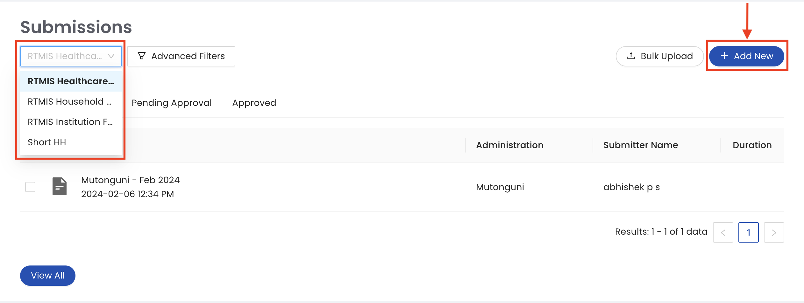
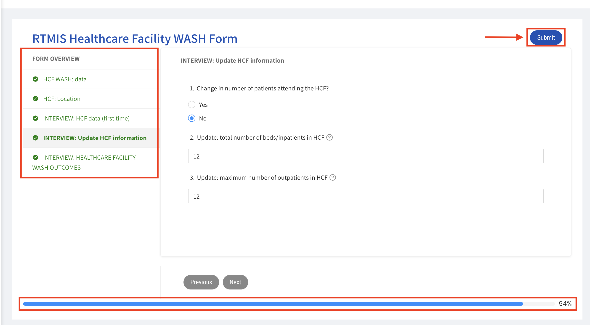
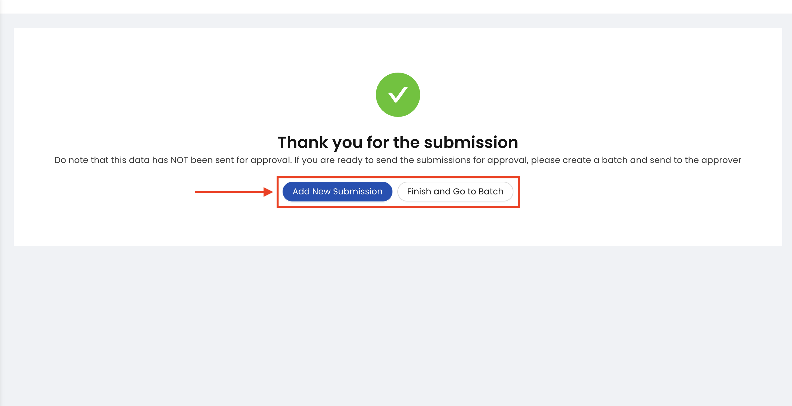
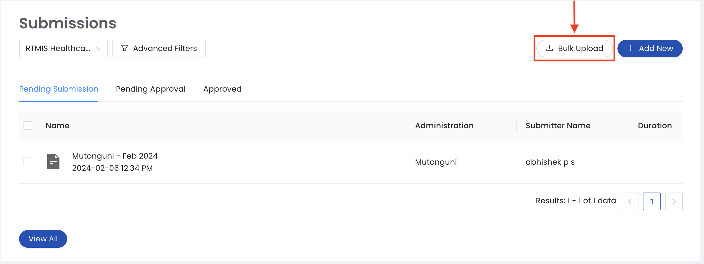
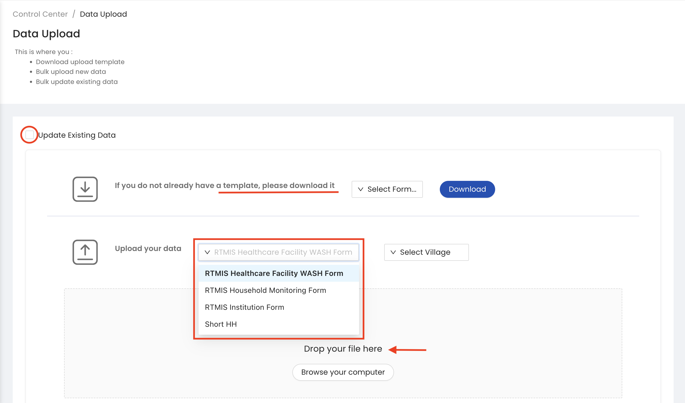

.. raw:: html

    

.. role:: heading

:heading:`Input Channels`

.. role:: bolditalic
  :class: bolditalic

.. _webforms:

Webforms
---------

1. From the submissions section of the control centre, select the questionnaire you would like to enter data against and click the :bolditalic:`ADD NEW` button to open the webform.

2. Fill all the mandatory fields (check the left pane of the webform to ensure all the sections are checked and keep an eye on the progress bar at the bottom) and then click the :bolditalic:`SUBMIT` button to upload your data.

3. Once you submit your form, you will be redirected to a page with the option to either add a new submission or to proceed to batch your data to send it for approval.

Bulk Upload
------------

1. From the submissions section of the control centre, click the :bolditalic:`BULK UPLOAD` button.

2. Select the questionnaire and village you would like to bulk upload data against and select the spreadsheet file on your computer. If you are updating existing data, make sure you tick the ‘update existing data’ checkbox.

