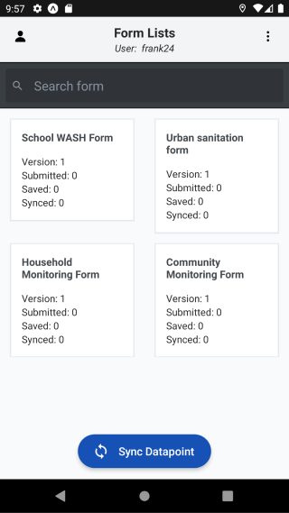

.. raw:: html

    

.. role:: heading

:heading:`Mobile App`

.. role:: bolditalic
  :class: bolditalic

.. _mobileauth:

Authentication
--------------

Authentication is the first step to accessing the mobile application. This app uses an authentication method with a passcode :code:`passcode` obtained from the :ref:`mobile assignment<mobile_assignment>`.

1. Press the :bolditalic:`Get started` button to begin using the application.

2. Enter the passcode correctly. If you are unsure, click **the eye icon to view the passcode**. Then click the **Login button** once you are confident.

3. If successful, you will be redirected to the application's main menu.

.. _mobile_dashboard:

Home overview
-------------

This application features a dashboard that displays most of the information about the questionnaire and basic submission statistics, such as:

* The number of saved submissions.
* The number of submitted submissions.
* The number of synchronized submissions.

Besides that, you can also do three things here:

1. Easily search for the questionnaire you want.

2. Go to the users page to get more information about the current user.

3. Go to the settings page to customize as needed.

Syncing Datapoints
------------------

.. note::
    This will ensure that your app has the most up-to-date information and data from the server.

Syncing datapoints is a feature that pulls data from the server to the mobile app. During this process, you will get the following:

* Re-fetching forms
* Re-downloading administration, organisations and entities data
* Getting the latest datapoints for monitoring and verification
* Getting certification assignments

To sync data with the server, follow these steps:

1. Click the :bolditalic:`Sync Datapoints` button. Wait until the process is finished.

Submission
----------

============
Registration
============

A registration submission is the initial datapoint submission that undergoes an approval process and is created by users with aligned administrative access rights.

==========
Monitoring
==========

A monitoring submission can be made when datapoints from the server are available after synchronization. This submission also undergoes an approval process similar to registration submissions.

============
Verification
============

A verification submission is available if it is activated in the questionnaire form. If not, this type of submission will not appear. Verification submissions do not require an approval process. Once the user completes the questionnaire, submits, and syncs, the datapoints will be available immediately.

=============
Certification
=============

A certification submission is a complex type of submission because it requires creating a :ref:`certification assignment<certification_assignment>` first.
:ref:`This certification assignment<certification_assignment>` is done on the admin panel and contains a list of administrations outside the mobile user's access rights but within the same county.
The certification list includes a dropdown filter to select which administration to process, making it easier for the mobile user to focus on one place before moving to another.

==============================
Save, Exit and Sync Submission
==============================

During the form-filling process, the mobile app also assists the user in exiting the questionnaire with the following options:

* Select :bolditalic:`Exit without saving` to exit the questionnaire without saving the current progress.

* Select :bolditalic:`Save and exit` to save the current progress. To continue filling out the form, reopen the related questionnaire and choose the :bolditalic:`Edit Saved Forms` menu, then click on the draft datapoint.

To ensure all question groups are answered, click the page number in the middle:

* **Blue**: indicates all questions have been answered and validated.
* **Gray**: indicates some questions are incomplete.

Generally, completed and submitted forms will automatically sync according to the applied sync interval settings. 
If the sync process is successful, *a green notification bar with "Done" will appear at the bottom*. The submission can then be viewed again in the :bolditalic:`View Submission Form` menu, as shown in the image below.

If automatic synchronization fails for any reason, the user can perform manual synchronization by pressing the **sync icon** in the top right corner. A confirmation dialog will appear; choose **OK** to proceed with synchronization.

Settings
--------

=================
Advanced Settings
=================

These settings allow you to customize your sync preferences with the following options:

* **Sync Interval**: The duration needed to sync submitted submissions to the server, measured in seconds.
* **Sync Wifi**: A switch to enable syncing of submitted submissions to the server only when using a Wi-Fi network.

====================
Geolocation Settings
====================

.. note::
    Adjust these settings according to your specific needs to balance between accuracy and performance.

These settings allow you to customize your geolocation preferences with the following options:

* **Threshold**: The maximum acceptable GPS error distance.
* **Accuracy Level**: The desired level of GPS accuracy. Higher accuracy reduces the risk of errors but may increase the time required to obtain a GPS fix.
* **Geolocation Timeout**: The maximum amount of time allowed to obtain a GPS value.

======================
Reset (Clear All Data)
======================

.. warning::
    Please note that this process cannot be undone, and all locally stored data will be lost. Make sure to sync any important data with the server before performing a reset.

This action will clear all data from the application, and you will need to sign in again to access your data.

To reset the application, follow these steps:

1. Click the :bolditalic:`Reset` button.
2. Confirm the reset process by clicking the **Yes** button.

