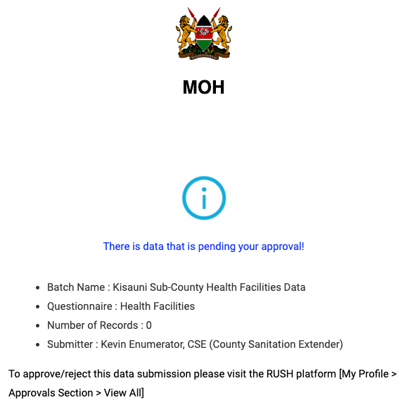

.. raw:: html

    

.. role:: heading

:heading:`Outputs`

Auto Generated visualisations
------------------------------

.. image:: ../assests/image13.png
    :alt: Visualisations
    :width: 100%

Report generation
------------------

Generation of maps
--------------------

.. image:: ../assests/image42.png
    :alt: Maps
    :width: 100%

Downloading data as spreadsheets
---------------------------------

Downloaded data can be accessed from the Downloaded Data tab of the control center. Click the download button to get your data in a spreadsheet.

.. image:: ../assests/image44.png
    :alt: spreadsheets
    :width: 100%

Notifications
---------------

Users will get email notifications in the following scenarios:

* Invitation to set up an account for the first time
* Approver is notified there is pending data for approval
* Submitter is notified when data is approved
* Submitter is notified when data is rejected

