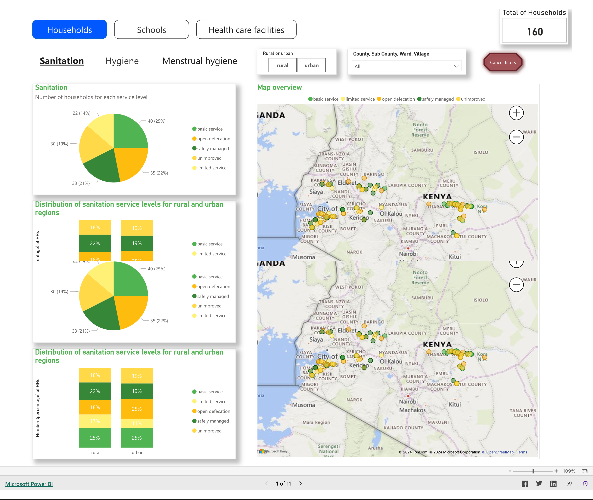
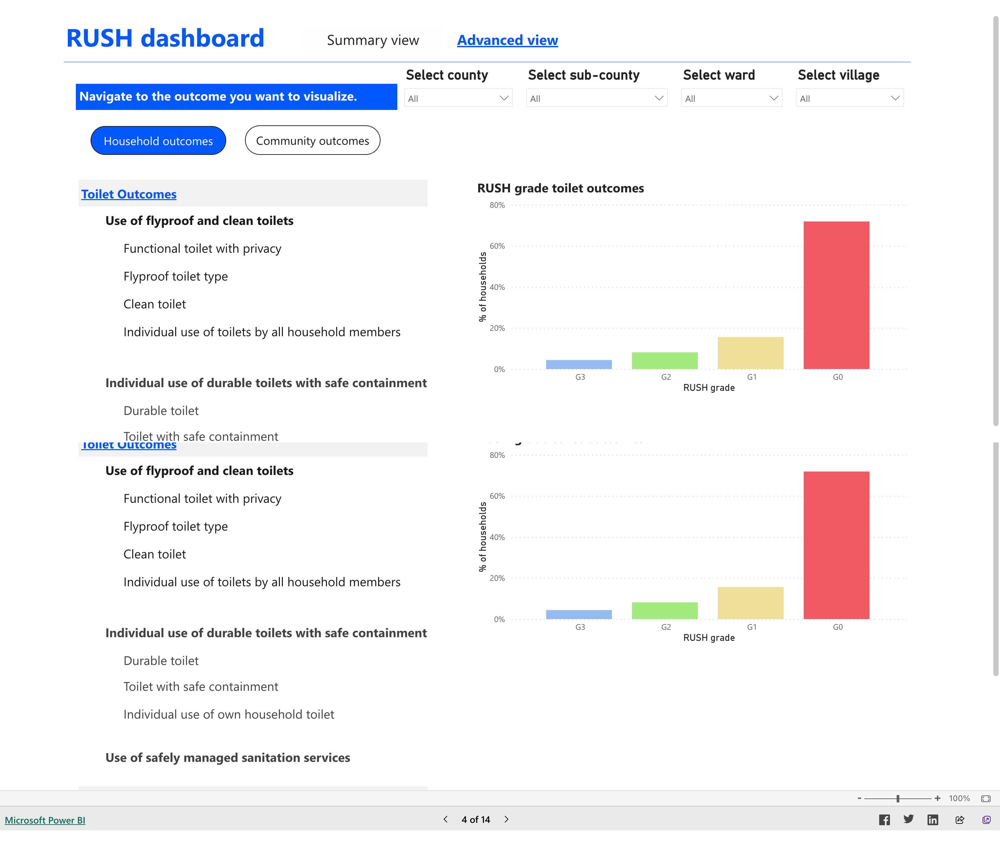

Practice session – setting up own accounts
===========================================
During this session, participants will get a chance to experience the RUSH RTMIS onboarding process for new users. System admins will set up accounts for new users and the new users will register and activate their accounts as per their allocated roles and regions.

Overview of Input Channels
~~~~~~~~~~~~~~~~~~~~~~~~~~~

.. role:: green

.. role:: bolditalic
  :class: bolditalic

:green:`Webforms`
-----------------

1. From the submissions section of the control centre, select the questionnaire you would like to enter data against and click the :bolditalic:`ADD NEW` button to open the webform.
  .. image:: ../assests/image6.png
     :alt: Add new
     :width: 100%

2. Fill all the mandatory fields (check the left pane of the webform to ensure all the sections are checked and keep an eye on the progress bar at the bottom) and then click the :bolditalic:`SUBMIT` button to upload your data.
  .. image:: ../assests/image12.png
     :alt: Submit
     :width: 100%

3. Once you submit your form, you will be redirected to a page with the option to either add a new submission or to proceed to batch your data to send it for approval.
  .. image:: ../assests/image4.png
     :alt: New Submission
     :width: 100%

:green:`Bulk Upload`
--------------------

1. From the submissions section of the control centre, select the questionnaire you would like to bulk upload data against and click the :bolditalic:`BULK UPLOAD` button.
  .. image:: ../assests/image27.png
     :alt: Bulk Upload
     :width: 100%

2. Select the questionnaire you would like to bulk upload data against and select the spreadsheet file on your computer. If you are updating existing data, make sure you tick the ‘update existing data’ checkbox.
  .. image:: ../assests/image33.png
     :alt: Update
     :width: 100%

In-depth presentation of Data forms 
~~~~~~~~~~~~~~~~~~~~~~~~~~~~~~~~~~~~

:green:`> Household data form` 
--------------------------------
:green:`> Schools and institutions data form`
----------------------------------------------
:green:`> Health care facilities data form`
--------------------------------------------
:green:`> Governance and Policy data form`
--------------------------------------------

Administration
~~~~~~~~~~~~~~~

:green:`Manage Users (Add, Delete and Modify Users)`
------------------------------------------------------

1. From the User Management tab of the control centre, click the :bolditalic:`Manage Users` button to add a new user, modify an existing user or delete an existing user.
  .. image:: ../assests/image48.png
     :alt: Manage User
     :width: 100%

2. To add a new user, click the :bolditalic:`ADD NEW USER` button. Next, fill all the mandatory fields and assign the user an organisation, designation, role, administrative region and questionnaires. Finally, click the Add User button to notify your new user. 
  .. image:: ../assests/image23.png
     :alt: Add new User
     :width: 100%

  .. image:: ../assests/image36.png
     :alt: Add new User
     :width: 100%

3. To delete an existing user, expand the toggle button next to the user and click the delete the :bolditalic:`DELETE` button. Next, confirm you are deleting the user by clicking the DELETE button in the pop-up window.
  .. image:: ../assests/image29.png
     :alt: Delete User
     :width: 100%
  
  .. image:: ../assests/image1.png
     :alt: Delete User
     :width: 100%

4. To modify an existing user, expand the toggle button next to the user and click the :bolditalic:`EDIT` button. Edit the user details and then click the :bolditalic:`UPDATE USER` button.
  .. image:: ../assests/image24.png
     :alt: Delete User
     :width: 100%
  
  .. image:: ../assests/image8.png
     :alt: Edited User
     :width: 100%

:green:`Manage Data Validation Setup`
--------------------------------------

1. Select the :bolditalic:`Manage Data Validation Setup` tab from the manage users section of the control centre to access the approval chain for every questionnaire. Here, you can assign approvers for each questionnaire for every administrative region. 
  .. image:: ../assests/image47.png
     :alt: Data validation
     :width: 100%

2. Assign each questionnaire an approver at the desired administrative region. Remember to save your changes.
  .. image:: ../assests/image22.png
     :alt: Data validation
     :width: 100%

Approval workflow
~~~~~~~~~~~~~~~~~~

:green:`Submitting Data for Approval`
--------------------------------------

1. All data that is pending submission for approval will appear on the pending submission tab. Note that you will need to select different questionnaires to see :bolditalic:`pending submissions` for each questionnaire. This is to avoid batching data from different questionnaires in one batch for approval which is not valid.
  .. image:: ../assests/image37.png
     :alt: Data validation
     :width: 100%

2. Next, select all the datasets you are submitting for approval by ticking the checkbox next to each data set then click the :bolditalic:`BATCH SELECTED DATASETS` button.
  .. image:: ../assests/image45.png
     :alt: Data validation
     :width: 100%

3. In the pop-up window, label your batch with a relevant name and add any comment for your approver. Next, tick the checkbox to :bolditalic:`send a new approval request` and click the :bolditalic:`CREATE A NEW BATCH` button.
  .. image:: ../assests/image14.png
     :alt: Data validation
     :width: 100%

4. Your dataset is now submitted for approval and will appear in the :bolditalic:`pending approval` tab. You can expand each data set to see your approver who will receive an email notification to approve your data.Notifications/Alerts
  .. image:: ../assests/image46.png
     :alt: Data validation
     :width: 100%
 
:green:`Approving Data`
------------------------

1. Data Approvers will receive an E-mail notification every time there is data that needs their approval within their assigned administrative region. Log in to approve the data.
  .. image:: ../assests/image32.png
     :alt: Approving
     :width: 100%
 
2. All datasets that are pending approval will appear in the :bolditalic:`My Pending Approvals` tab of the Approvals section. Click the :bolditalic:`View All` button to begin the approval process.
  .. image:: ../assests/image38.png
     :alt: Approving
     :width: 100%
 
3. To approve or decline a dataset, expand the toggle button next to each data set. Here we have two tabs:
**Data Summary**: A quick snapshot of the data you are approving.
**Raw Data**: From this tab, you can access the raw data, make edits and save edits.
You can add notes and feedback and the data submitter will receive an email notification once the dataset is approved or declined.
  .. image:: ../assests/image7.png
     :alt: Decline or approve
     :width: 100%

  .. image:: ../assests/image2.png
     :alt: Decline or approve
     :width: 100%
 
1. Note: Rejected datasets will appear in the :bolditalic:`My Pending Approvals` tab with the status :bolditalic:`Rejected:bolditalic:`. The status will change to :bolditalic:`Pending` when the data submitter updates the rejected dataset as per the Approver’s instructions.

:green:`Handling Rejected Data`
--------------------------------

1. Rejected datasets will appear in the :bolditalic:`Pending Approval` tab with the status :bolditalic:`Rejected:bolditalic:`. Enumerators will receive an email notification when their data is rejected with an explanation from the approver why the data was rejected. Next, expand the toggle button next to the rejected dataset to make edits and resubmit your dataset.
  .. image:: ../assests/image26.png
     :alt: Reject Data
     :width: 100%

2. From the :bolditalic:`Raw Data` tab, make any edits as per your Approver’s instructions. You can reset to default values in case you make an error while editing. Finally, when you are done with all edits click the :bolditalic:`SAVE EDITS` button. Your dataset will now appear under :bolditalic:`Pending Approval` with the status :bolditalic:`Pending` and your Approver will be able to review and approve again.
  .. image:: ../assests/image5.png
     :alt: Reject Data
     :width: 100%

Data Management
~~~~~~~~~~~~~~~~

:green:`Data Protection Act`
-----------------------------

* The data protection act seeks to give effect to Article 31(c) and (d) of the Constitution that contain the right to privacy, regulate the processing of personal data, provide for the rights of data ‘subjects’; and defines the obligations of data ‘controllers’ (person who determines the purpose and means of processing of personal data) and ‘processors’ (person who processes personal data on behalf of the data controller).

* Every data controller or data processor is required to ensure the storage, on a server or data centre located in Kenya, of at least one serving copy of personal data to which the Act applies. Cross-border processing of sensitive personal data is prohibited and only allowed when certain conditions are met or under certain circumstances specified in the Act.

:green:`Collecting Data in the Field`
--------------------------------------

**Sampling**
The sources of data for the RTMIS are both primary and secondary. The data will be collected from all the 47 counties in Kenya. The basic unit for the sanitation and hygiene primary data shall be the households in both Rural and urban setups. Sanitation and hygiene primary data shall also be collected from Schools and health care facilities nationwide.   Secondary data will be collected at the county level to report on financing. At the sub-county level, urban sanitation data will be enriched with data/information from the WARIS system. During phase 1 of RUSH RTMIS implementation, data collection shall proceed as follows:

* Data shall be collected from every village/community in the 47 counties of kenya
* In each village/community, 20 HHs shall be picked randomly. This sampling method will apply for both rural and urban villages/communities
* All schools  from all the 47 counties shall be surveyed
* All levels of health care facilities from all the 47 counties shall be surveyed

During phase 2 of RUSH RTMIS implementation, data collection will be done at every household. Therefore there shall be no sampling of households moving forward.

**HH coding**
* To ensure ease of reference during repeat data collection (particularly during phase 2 of RUSH RTMIS implementation), all households will be coded with a unique code
* This unique code will apply when the RUSH protocol is fully implemented 
* The Unique Code shall be composed as follows:  Village name+SN + HH Head's Surname

:green:`Deleting data`
-----------------------

From the Manage Data section of the control centre, expand the toggle button next to a data point to delete it.
.. image:: ../assests/image43.png
    :alt: Deleting Data
    :width: 100%

:green:`Downloading data`
--------------------------

.. image:: ../assests/image11.png
    :alt: Downloading Data
    :width: 100%

.. image:: ../assests/image44.png
    :alt: Downloading Data
    :width: 100%

Outputs
~~~~~~~~

:green:`Auto Generated visualisations`
---------------------------------------

:green:`Report generation`
--------------------------

:green:`Generation of maps`
-----------------------------

:green:`Downloading data as spreadsheets`
------------------------------------------

Downloaded data can be accessed from the Downloaded Data tab of the control center. Click the download button to get your data in a spreadsheet.
.. image:: ../assests/image44.png
    :alt: spreadsheets
    :width: 100%

:green:`Notifications`
------------------------

Users will get email notifications in the following scenarios:

* Invitation to set up an account for the first time
* Approver is notified there is pending data for approval
* Submitter is notified when data is approved
* Submitter is notified when data is rejected

.. image:: ../assests/image32.png
    :alt: Notifications
    :width: 100%

Individual Practice
~~~~~~~~~~~~~~~~~~~~

* User Management
* Approval Workflow
* Data Management
* Outputs
