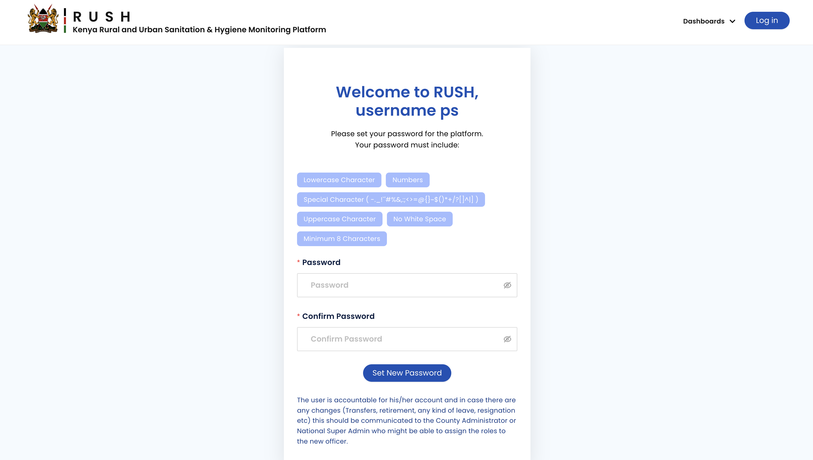

.. raw:: html

    

.. role:: heading

:heading:`Get Started`

User Types & Basic principal
-----------------------------

* There are two types of users that comprise Platform administrators (Super admins, County admins, sub county PHOs/Approvers), data collectors (Data Entry Supervisor)
* A user can only be added by authorised users with admin or super admin roles
* A county admin can only add users for their county
* A user can only be deleted if there are no approvals or batching operations pending on them
* Only super admins can add users with an admin role
* A county admin can only assign questionnaires from the list of questionnaires that they have been assigned
* Data entered by super admins is automatically approved
* Data can be updated for an existing data point. Update is only be possible if that data point is not pending approval
* Approved data can only be deleted by county admin or super admin
* Data entered by county admin is automatically approved if the questionnaire has final approval in the county level
* Once a data set is rejected, the pending approval lock is removed so that it can be edited.

User Roles and Permissions
---------------------------

+---------------------------+------------------------+----------------------------------------------+
| User Roles                | Privileges             | Definitions                                  |
+===========================+========================+==============================================+
|| **Data Submitter**       || Data upload, View     || A Data Entry Supervisor can only edit       |
||                          ||                       || data if the  approver has rejected the data |
+---------------------------+------------------------+----------------------------------------------+
|| **Approver**             || Edit, View, Data      || Approvals restricted by region              |
||                          || Approval              ||                                             |
+---------------------------+------------------------+----------------------------------------------+
|| **County Administrator** ||  Edit, View, Approve, || County level administrators will manage     |
||                          || Manage Users          || users In addition to everything that an     |
||                          ||                       || approver can do                             |
+---------------------------+------------------------+----------------------------------------------+
|| **Super Administrator**  || Edit, View, Approve,  || National level administrators with country  |
||                          || Manage Users, Manage  || wide scope . Will all privileges along with |
||                          || survey configurations || managing key system level configurations    |
+---------------------------+------------------------+----------------------------------------------+

Setting up Account for the First Time
---------------------------------------

Users who have been registered in the RUSH platform will receive an invitation email to complete the account setup process. Click the Set Password button to activate your account. Make sure you are on the testing url rtmis.akvo.org. Set a strong password and click Set New Password to login to your account.

